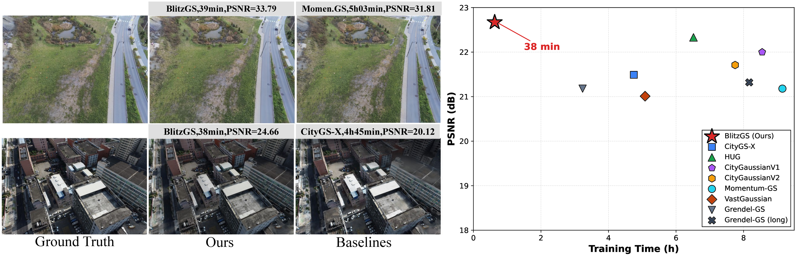

<div align="center">

# ⚡ BlitzGS 🏙️

**A distributed 3D Gaussian Splatting framework for fast city-scale reconstruction.**

[](https://arxiv.org/abs/2605.13794)
[](https://github.com/AkierRaee/BlitzGS)



</div>


BlitzGS is a high-performance distributed 3D Gaussian Splatting (3DGS) framework designed for rapid, city-scale 3D reconstruction. By focusing on active workload control, BlitzGS cuts down training time from hours to under 40 minutes on standard multi-GPU setups while maintaining state-of-the-art rendering quality.

## 🔧 Pipeline


## 🛠️ Installation

```bash
conda env create -f blitzgs_environment.yml
conda activate blitzgs

# PyTorch3D
pip install --no-build-isolation \
    "git+https://github.com/facebookresearch/pytorch3d.git@v0.7.9"

# Install the four CUDA submodules in editable mode
pip install --no-build-isolation submodule/diff-gaussian-rasterization_r
pip install --no-build-isolation submodule/diff-gaussian-rasterization_f
pip install --no-build-isolation submodule/simple-knn
pip install --no-build-isolation submodule/fused-ssim
```

## 📂 Data

Create a `data/` folder at the project root:

```bash
mkdir data
```

### Get the COLMAP result

Download the datasets following [the Mega-NeRF repository](https://github.com/cmusatyalab/mega-nerf).

For Mill-19 and UrbanScene3D, run the following for each scene:

```bash
python tools/merge_val_train.py -d $DATASET_DIR(data/<scene_name>)
bash tools/colmap_full.sh $COLMAP_RESULTS_DIR $DATASET_ROOT(data/<scene_name>)
```

For MatrixCity, follow the preprocessing from [CityGaussianV2](https://github.com/Linketic/CityGaussian/blob/main/doc/data_preparation.md).


### Expected directory layout

```
data/
├── <scene_name>  (Mill-19 and UrbanScene3D)
│   ├── train/
│   │   └── rgbs/        000000.jpg, 000001.jpg, ...
│   ├── val/
│   │   └── rgbs/        000000.jpg, 000001.jpg, ...
│   └── sparse/0/
├── <scene_name>  (MatrixCity)
│   ├── train/block_all/
│   │   ├── images/      0000.png, 0001.png, ...
│   │   └── sparse/0/
│   └── test/block_all_test/
│       ├── images/      0000.png, 0001.png, ...
│       └── sparse/0/
```

## 🚀 Training

One script per benchmark scene, using the paper configuration. Each script trains, renders the evaluation split, and computes PSNR / SSIM / LPIPS:

```bash
bash scripts/train_building.sh      # Mill-19 Building
bash scripts/train_rubble.sh        # Mill-19 Rubble
bash scripts/train_residence.sh     # UrbanScene3D Residence
bash scripts/train_sciart.sh        # UrbanScene3D Sci-Art
bash scripts/train_matrixcity.sh    # MatrixCity aerial
```

Dataset path, output folder, and GPU count can be overridden with environment variables:

```bash
DATA=data/rubble-pixsfm OUT=output/rubble NPROC=4 bash scripts/train_rubble.sh
```

The scripts enable the spawn gate, which vetoes densification candidates predicted not to survive, using the pretrained survival models shipped in `models/`. Each benchmark script loads the gate model fitted with that scene held out (`spawn_gate_LOSO_*.pkl`).

## 🙏 Acknowledgements

We thank the authors of the following open-source projects for their excellent work, which this codebase builds upon:

- [3D Gaussian Splatting](https://github.com/graphdeco-inria/gaussian-splatting) 
- [CityGS-X](https://github.com/gyy456/CityGS-X)
- [Octree-AnyGS](https://github.com/city-super/Octree-AnyGS)
- [mini-splatting2](https://github.com/fatPeter/mini-splatting2)

## 📞 Contact

If you have any problems, feel free to contact us:

wangzhongtao[at]stu.pku.edu.cn or huishan_au[at]stu.pku.edu.cn


## 📜 License

Released under the **Gaussian-Splatting License** (research and non-commercial use). See [LICENSE.md](LICENSE.md). The included rasterizers in `submodule/` are derivatives of Inria's `diff-gaussian-rasterization` and inherit the same license; `submodule/fused-ssim/` is MIT.

## 📝 Citation

```bibtex
@misc{wang2026blitzgscityscalegaussiansplatting,
      title={BlitzGS: City-Scale Gaussian Splatting at Lightning Speed}, 
      author={Zhongtao Wang and Huishan Au and Yilong Li and Mai Su and Haojie Jin and Yisong Chen and Meng Gai and Fei Zhu and Guoping Wang},
      year={2026},
      eprint={2605.13794},
      archivePrefix={arXiv},
      primaryClass={cs.GR},
      url={https://arxiv.org/abs/2605.13794}, 
}
```
